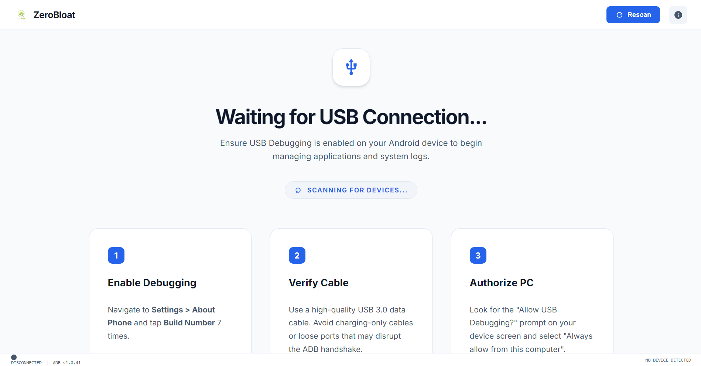
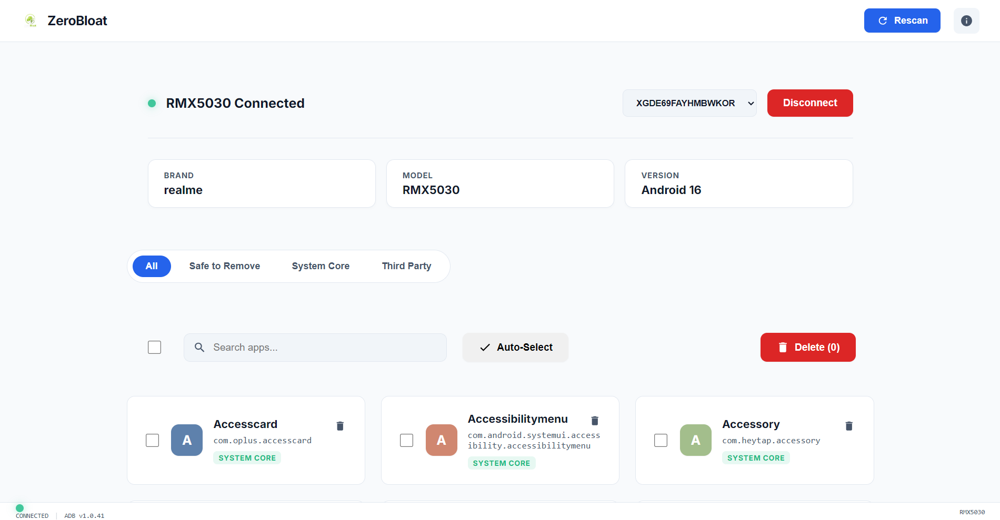

# ZeroBloat

ZeroBloat is a desktop app for removing unwanted Android system apps and bloatware using ADB — no root required.

Built with Go, Svelte, and Wails.


---

## Screenshot




---

## Features

* Detects connected Android devices automatically
* Lists installed packages
* Separates apps into:

  * Bloatware
  * System apps
  * User-installed apps
* Search and filter packages
* Select multiple packages and uninstall at once
* Warns before removing important system packages
* Runs ADB commands silently in the background

---

## Download

Prebuilt binaries are available from the Releases page:

[ZeroBloat Releases](https://github.com/AdhwaithAS/ZeroBloat/releases?utm_source=chatgpt.com)

### Before using

Enable USB debugging on your Android device:

1. Open **Settings → About Phone**
2. Tap **Build Number** 7 times
3. Open **Developer Options**
4. Enable **USB Debugging**

### Run

* **Windows** → `ZeroBloat.exe`
* **macOS** → `ZeroBloat.app`
* **Linux** → `chmod +x ZeroBloat.AppImage`

Connect your phone with a USB cable and the app will detect it automatically.

---

## Development

### Requirements

* Go 1.21+
* Node.js 18+
* Wails CLI

Install Wails:

```bash
go install github.com/wailsapp/wails/v2/cmd/wails@latest
```

### Clone

```bash
git clone https://github.com/AdhwaithAS/ZeroBloat.git
cd ZeroBloat
```

### Run in development mode

```bash
wails dev
```

### Build

```bash
wails build
```

---

## License

MIT License.

---

## Author

GitHub: [@AdhwaithAS](https://github.com/AdhwaithAS?utm_source=chatgpt.com)

Support the project:
[Buy Me a Coffee](https://buymeacoffee.com/adhwaithas?utm_source=chatgpt.com)
